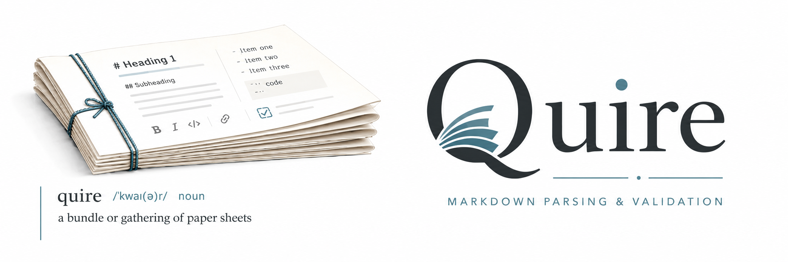

<p align="center">
  
</p>

# @agent-ix/quire

[](https://discord.gg/6qsdhSPE)

> **quire** _(noun)_ — a gathering of sheets, folded together; from Latin _quaternī_ (four each). In bookbinding, the fundamental unit of structure from which a complete volume is assembled.

Structured document interaction library — Parse, query, and render markdown document sections as typed React components.

## What It Does

Quire takes raw markdown content and provides:

- **Parsing** — split documents into a typed section tree
- **Querying** — access sections, tables, lists, and diagrams by name
- **Rich rendering** — render parsed objects as custom React components (badges, icons, interactive tables)
- **Markdown fallback** — sections without custom renderers display via `markdown-editor` (read-only)
- **Write-back** — modify sections and serialize back to markdown

## Architecture

```
Layer 3: React Context     — QuireProvider, SectionCard, SectionTable, AutoSections
Layer 2: Query API         — section(), tables(), lists(), diagrams(), search()
Layer 1: Parser            — parseDocument(), extractFrontmatter(), parseBulletList()
```

Layers 1+2 are pure TypeScript with zero React dependency — usable by agents, scripts, and CLI tools.

## Development

### Storybook

Run Storybook locally in Docker (exposed at http://quire.ix):

```bash
make storybook
```

Stop Storybook:

```bash
make storybook-stop
```

### Testing

```bash
make test
```

### Build

```bash
make build
```
